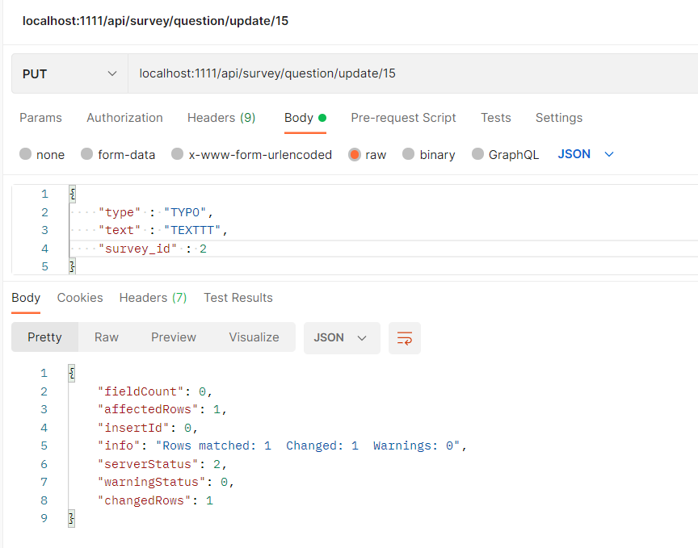

# Тестування працездатності системи

# Отримання списку опитувань

# Додавання опитування

# Видалення опитування

# Зміна опитування

# Стан опитування

# Отримання списку питань опитування

# Додавання питання

# Видалення питання

# Зміна питанняfi

